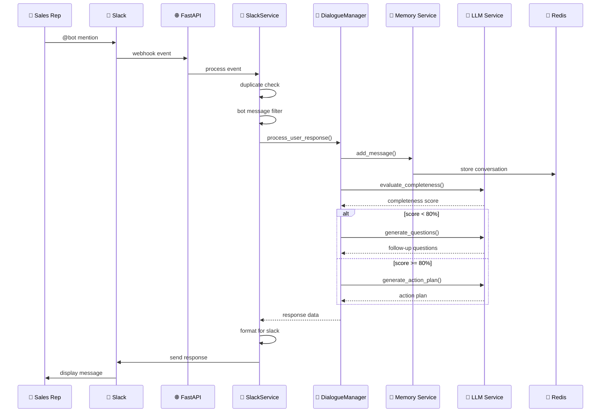

# 営業成長AI支援エージェント - アーキテクチャドキュメント

## 📐 システムアーキテクチャ概要

### 🏛️ アーキテクチャパターン
- **マイクロサービス型**: コンポーネントの疎結合設計
- **イベント駆動**: Slackイベントベースの非同期処理
- **レイヤードアーキテクチャ**: 明確な責任分離

### 🔄 データフロー



## 🏗️ コンポーネント詳細

### 1. 📡 API Gateway Layer

#### FastAPI Server (`app/main.py`)
```python
# 役割: HTTPリクエストの受付とルーティング
# 技術: FastAPI, CORS, 非同期処理
# 責任:
- Slack webhook受信
- ヘルスチェック
- エラーハンドリング
- ミドルウェア処理
```

#### Slack Endpoints (`app/api/slack_endpoints.py`)
```python
# エンドポイント構成:
POST /api/slack/events    # メインwebhook
GET  /slack/health       # ヘルスチェック
POST /slack/install      # アプリインストール（将来用）
GET  /slack/oauth        # OAuth認証（将来用）
```

### 2. 🧠 Core Service Layer

#### SlackService (`app/services/slack_service.py`)
```python
# 役割: Slackイベント処理とBot機能
# 主要機能:
class SlackService:
    - _is_bot_message()         # Bot自身のメッセージ検出
    - _is_duplicate_event()     # 重複イベント防止
    - _handle_message()         # メッセージ処理統合
    - _format_*_for_slack()     # レスポンス整形
    
# 安全機能:
- タイムスタンプベース重複検出
- 5分間のイベント履歴管理
- Bot無限ループ防止
```

#### DialogueManager (`app/services/dialogue_manager.py`)
```python
# 役割: AI対話フロー制御
# 主要機能:
class DialogueManager:
    - process_user_response()      # ユーザー入力処理
    - _evaluate_completeness()     # 情報完成度評価
    - _generate_follow_up_questions() # 追加質問生成
    - _generate_action_plan()      # アクションプラン作成
    
# AI処理フロー:
1. 情報完成度評価 (0-100%)
2. 閾値判定 (80%未満: 質問継続, 80%以上: プラン生成)
3. LLM API呼び出し
4. 構造化レスポンス生成
```

#### ConversationMemoryService (`app/services/conversation_memory.py`)
```python
# 役割: 会話コンテキスト管理
# 技術: LangChain Memory + Redis
# 主要機能:
class ConversationMemoryService:
    - get_or_create_memory()    # メモリ取得/作成
    - add_message()             # メッセージ追加
    - get_conversation_context() # コンテキスト取得
    
# メモリ構成:
- ConversationSummaryBufferMemory (LangChain)
- Redis永続化 (TTL: 24時間)
- セッション単位管理
```

### 3. 🤖 LLM Integration Layer

#### LLM Provider Selection
```python
# 設定ベース選択:
if settings.USE_MOCK_LLM:
    provider = MockLLMProvider()    # 開発用
else:
    provider = RealLLMService()     # 本番用 (OpenAI)
```

#### RealLLMService (`app/services/real_llm_service.py`)
```python
# OpenAI GPT-3.5-turbo統合
# 機能:
- 非同期API呼び出し
- エラーハンドリング
- レート制限対応
- 構造化プロンプト処理
```

#### MockLLMProvider (`app/services/mock_llm.py`)
```python
# 開発・テスト用モック
# 機能:
- API不要のローカル処理
- 決定的なレスポンス生成
- キーワードベース分析
- テンプレート化された質問・プラン
```

### 4. 💾 Data Layer

#### Redis Configuration
```python
# 設定:
REDIS_URL = "redis://localhost:6379/0"
TTL = 24 * 60 * 60  # 24時間

# 使用用途:
- 会話履歴保存 (LangChain Chat History)
- セッション状態管理
- 一時的なコンテキストストレージ
```

#### SQLite (Optional)
```python
# モデル:
- DialogueSession    # セッション情報
- DialogueMessage    # メッセージ履歴
- DialogueContext    # コンテキスト情報

# 注意: 現在は無効化状態 (Redis優先)
```

## 🛡️ セキュリティ・信頼性設計

### 1. イベント重複防止
```python
# 実装箇所: SlackService._is_duplicate_event()
# 仕組み:
event_key = f"{timestamp}_{user}_{channel}"
if event_key in processed_events:
    return True  # 重複として処理をスキップ

# クリーンアップ: 5分毎に古いイベントIDを削除
```

### 2. Bot無限ループ防止
```python
# 実装箇所: SlackService._is_bot_message()
# チェック項目:
- event.get("subtype") == "bot_message"
- event.get("bot_id") is not None
- event.get("user").startswith("B")  # Bot User ID
```

### 3. エラーハンドリング
```python
# レイヤー別エラー処理:
# API Layer: HTTPException with 500
# Service Layer: ログ出力 + Fallback
# LLM Layer: デフォルト値返却
# Data Layer: グレースフル劣化
```

### 4. 設定管理
```python
# 環境変数ベース設定:
class Settings(BaseSettings):
    USE_MOCK_LLM: bool = False
    OPENAI_API_KEY: str = ""
    SLACK_BOT_TOKEN: str = ""
    # ...
    
    class Config:
        env_file = ".env"
        case_sensitive = True
```

## 📊 パフォーマンス設計

### 1. 非同期処理
```python
# 全てのI/O操作は非同期:
async def process_user_response() -> Dict[str, Any]
async def ainvoke(messages: List[Dict]) -> AIMessage
async def add_message() -> SimpleMessage
```

### 2. メモリ効率
```python
# Redis TTL設定:
- 会話履歴: 24時間
- セッション状態: 自動削除
- イベント履歴: 5分間

# 重複防止セット: 定期クリーンアップ
```

### 3. API制限対応
```python
# OpenAI API:
- Exponential backoff
- Error handling with fallbacks
- Connection pooling

# Slack API:
- Rate limit headers監視
- Retry logic with delays
```

## 🔧 拡張性設計

### 1. LLM Provider抽象化
```python
# 新しいLLMプロバイダー追加:
class NewLLMService:
    async def evaluate_completeness() -> int
    async def generate_questions() -> List[str]
    async def generate_action_plan() -> Dict
```

### 2. メッセージフォーマット抽象化
```python
# 新しいチャットプラットフォーム追加:
class TeamsService(BaseMessageService):
    def _format_questions_for_teams() -> str
    def _format_action_plan_for_teams() -> str
```

### 3. 設定駆動開発
```python
# 機能フラグによる段階的展開:
ENABLE_VOICE_MESSAGES: bool = False
ENABLE_ANALYTICS: bool = False
ENABLE_MULTI_LANGUAGE: bool = False
```

## 🧪 テスト戦略

### 1. ユニットテスト
```python
# テスト対象:
- DialogueManager.process_user_response()
- ConversationMemoryService.add_message()
- MockLLMProvider.generate_questions()
- SlackService._is_bot_message()
```

### 2. 統合テスト
```python
# エンドツーエンドテスト:
- Slack webhook → AI応答フロー
- Redis接続・切断テスト
- OpenAI API統合テスト
```

### 3. モックテスト
```python
# 外部依存関係のモック:
- OpenAI API レスポンス
- Slack API 呼び出し
- Redis 接続
```

## 📈 監視・運用

### 1. ログ設計
```python
# 構造化ログ:
logger.info("Processing user message", extra={
    "session_id": session_id,
    "user_id": user_id,
    "completeness_score": score,
    "response_type": response_type
})
```

### 2. メトリクス
```python
# 主要指標:
- 対話セッション数/時間
- 平均完成度スコア
- アクションプラン生成率
- API応答時間
- エラー率
```

### 3. ヘルスチェック
```python
# エンドポイント: GET /slack/health
# チェック項目:
- Slack認証情報
- Redis接続
- OpenAI API接続
- サービス初期化状態
```

---

このアーキテクチャにより、**スケーラブル**、**保守性が高く**、**拡張可能**な営業成長AI支援システムを実現しています。