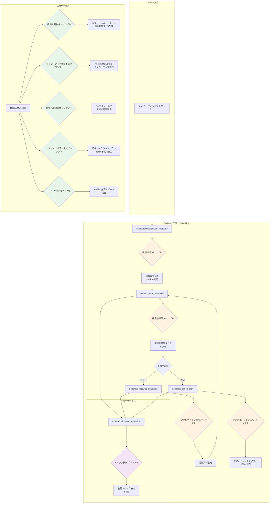
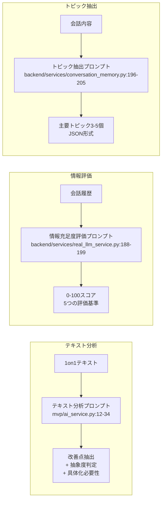
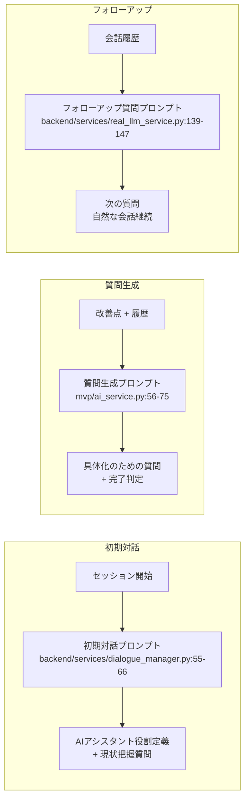
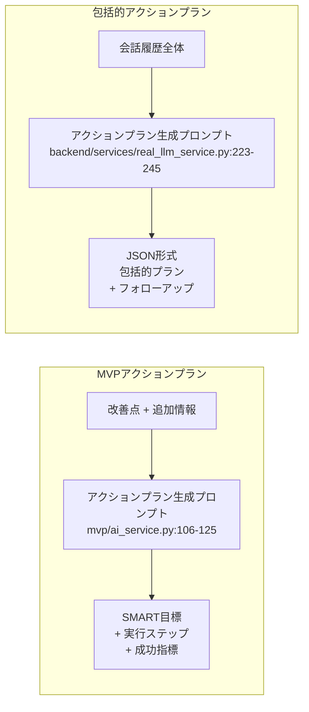
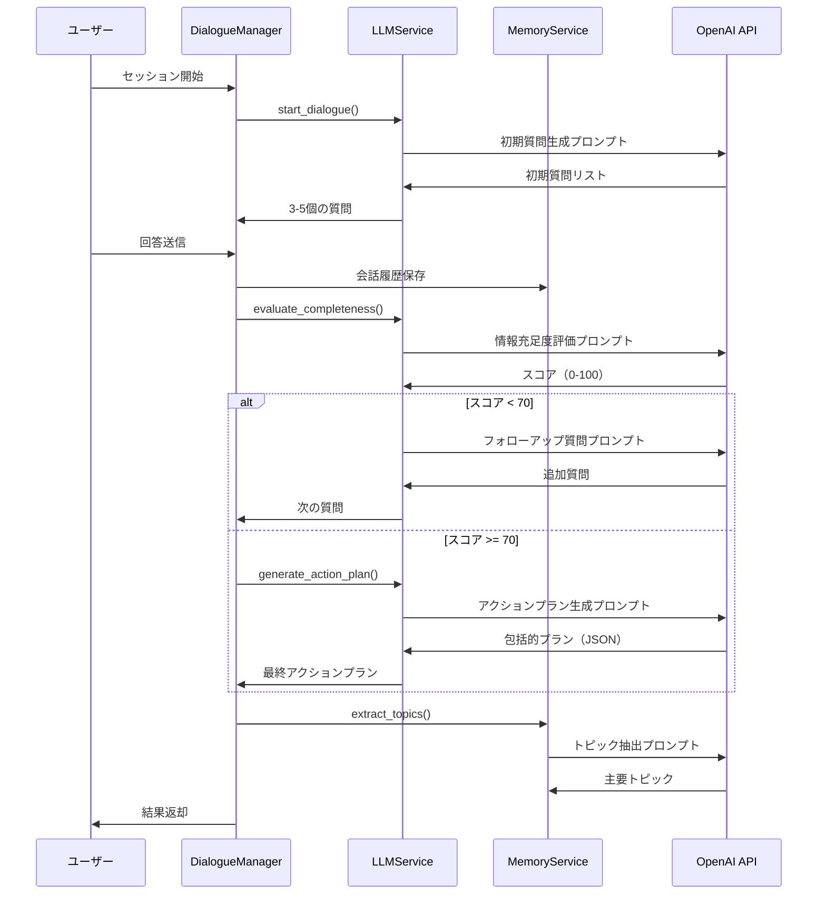

# Sales Growth AI Agent - LLMプロンプトフロー図

## システム全体のプロンプトフロー

## プロンプトの種類と役割

### 1. 分析系プロンプト

### 2. 対話系プロンプト

### 3. 計画系プロンプト

## プロンプトの実行フロー詳細

### システムフロー（FastAPI）

## プロンプトのシステム構成

### システムプロンプト（役割定義）
1. **経験豊富なセールスコーチ** (backend/services/real_llm_service.py)
2. **AIアシスタント** (backend/services/dialogue_manager.py)

### レスポンス形式指定
- **JSON Object**: 構造化された回答が必要な分析・評価系
- **自然言語**: 対話継続が必要な質問生成系
- **数値のみ**: スコア評価系（0-100）

### プロンプトの特徴
- **日本語最適化**: 全プロンプトが日本の営業環境に特化
- **段階的情報収集**: 初期→詳細→完全性評価→プラン生成
- **文脈保持**: 会話履歴を効果的に活用
- **実用性重視**: 実行可能で測定可能な成果を目指す